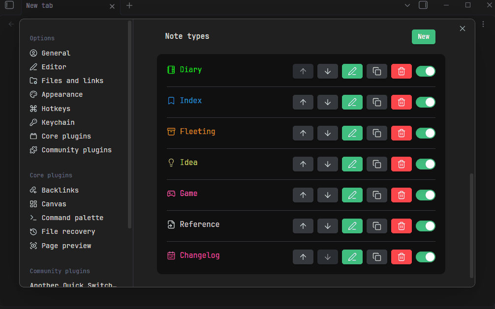

# Obsidian Note Type



## Features

- Adds a **Note Type** dropdown in the Properties editor to change the current note's type.
- Switching a note type populates properties and content from a template (supports built-in syntax and [Templater](https://github.com/SilentVoid13/Templater)).
- Default note type: automatically apply a note type to new files.

This plugin is heavily inspired by the latest update of [Octarine](https://octarine.app/changelog/0.42.0) (v0.42). Essentially, it just changes the Templater/QuickAdd template-filling workflow (`Run command -> Choose template`) into a dropdown-based switcher, but in my personal opinion, it greatly improves the user experience. Huge thanks to Octarine for the idea!


## Getting Started

1. Install the plugin.
2. Add your **Note Types** (see configuration details below).
3. Open any note — use the dropdown at the top of the Properties editor to switch note types.

### How It Works

The plugin does not introduce new note syntax, just binds a configurable property key (default: `noteType`) to represent the note type. A dropdown is displayed in the Properties editor listing all predefined note types. When a type is selected, the corresponding template is formatted and applied, both properties (frontmatter) and body content are populated.

## Configuration

### Base Settings

| Setting                     | Description                                                                         |
| --------------------------- | ----------------------------------------------------------------------------------- |
| **Property key**            | The frontmatter property key used to identify the note type (default: `noteType`).  |
| **Hide note type property** | When enabled, the raw property input is hidden — only the styled dropdown is shown. |

### Note Types

Define your note types here. Each note type has the following options:

| Field         | Description                                                                |
| ------------- | -------------------------------------------------------------------------- |
| **Key**       | Unique identifier written to the configured property key.                  |
| **Name**      | Display name shown in the dropdown.                                        |
| **Icon**      | Icon from [Lucide](https://lucide.dev/icons) displayed alongside the name. |
| **Color**     | Color applied to the icon and name in the dropdown.                        |
| **Template**  | Path to the template file used when this note type is selected.            |
| **Formatter** | The engine used to process the template (see below).                       |

#### Formatters

##### Default (Built-in)

Uses `{{ variable }}` or `{{ date:format }}` syntax with variable. The following variables are available:

- **now** / **date**: Alias for `moment().format()`. see: https://momentjs.com/docs
    ```js
    {{ now }} // default: YYYY-MM-DD hh:mm:ss
    {{ now:YYYY-MM-DD }}
    ```
- **ctime** / **mtime**: create time / modify time of current note
    ```js
    {{ ctime }} // default: YYYY-MM-DD hh:mm:ss
    {{ mtime:YYYY-MM-DD }}
    ```
- **name** / **ext** / **fullname**: name of current note.
    ```js
    {{ fullname }} // foo.md
    {{ name }} // name
    {{ ext }} // md
    ```

##### Templater

More complex templates can be implemented using the **Templater** plugin, see: [Templater document](https://silentvoid13.github.io/Templater)

### Overwrite Behavior

When a note already has content, you can control how templates are applied. If **Show conflict modal** is enabled, you will be prompted to choose the behavior each time a conflict occurs. Otherwise, the default settings are used.

#### Property Behavior

| Option        | Description                                                                    |
| ------------- | ------------------------------------------------------------------------------ |
| **Replace**   | Replace all properties with the template's properties.                         |
| **Keep**      | Keep existing properties, skip conflicting ones from the template.             |
| **Overwrite** | Keep existing properties, but overwrite those that conflict with the template. |

#### Content Behavior

| Option      | Description                                          |
| ----------- | ---------------------------------------------------- |
| **Replace** | Replace with the template's content.                 |
| **Keep**    | Preserve the existing note content (do not replace). |

### Default Note Type

| Setting                      | Description                                                                                                   |
| ---------------------------- | ------------------------------------------------------------------------------------------------------------- |
| **Enable default note type** | When a file without a note type is opened, automatically assign the default note type and apply its template. |
| **Default note type**        | The note type to use as the default.                                                                          |
| **Empty note only**          | Only apply the note type to empty files.                                                                      |
